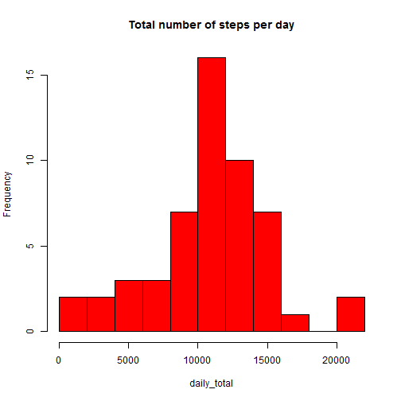

## Loading and preprocessing the data

```r
setwd("c:/rwork/reproducable research")
activity.data <- read.csv(file="./activity.csv", header=TRUE, na.strings="NA", 
                          colClasses=c("numeric", "Date", "numeric"))
summary(activity.data)
```

```
##      steps             date               interval     
##  Min.   :  0.00   Min.   :2012-10-01   Min.   :   0.0  
##  1st Qu.:  0.00   1st Qu.:2012-10-16   1st Qu.: 588.8  
##  Median :  0.00   Median :2012-10-31   Median :1177.5  
##  Mean   : 37.38   Mean   :2012-10-31   Mean   :1177.5  
##  3rd Qu.: 12.00   3rd Qu.:2012-11-15   3rd Qu.:1766.2  
##  Max.   :806.00   Max.   :2012-11-30   Max.   :2355.0  
##  NA's   :2304
```

## What is mean total number of steps taken per day?

```r
day.total <- aggregate(steps ~date, activity.data, sum, na.rm=T)
names(day.total) <- c("date", "daily_total")
with (day.total, hist(daily_total, main="Total number of steps per day", col="red", breaks=10))
```

 

```r
daily.mean <- as.integer(mean(day.total$daily_total, na.rm=T))
daily.median <- as.integer(median(day.total$daily_total, na.rm=T))
```
The mean total number of steps taken per day is 10766.

The median total number of steps taken per day is 10765.

## What is the average daily activity pattern?

```r
interval.average <- aggregate(steps ~interval, activity.data, mean)
names(interval.average) <- c("interval", "step_average")
plot(interval.average$interval, interval.average$step_average, type="l", 
     xlab="Interval", ylab="Step average", 
     main="Average steps on interval across all days")
```

 

```r
max.step.interval <- which.max(interval.average$step_average)
```
Interval 104 contains the maximum numer of steps on average across all the days.

## Imputing missing values

```r
na.count <- sum(is.na(activity.data$ste))
```
There are 2304 missing values in the dataset.

```r
activity.data.na.filled <- activity.data
for (i in c(1:nrow(activity.data))) {
  if (is.na(activity.data[i,1])) {
    activity.data.na.filled[i,1] <- interval.average[which(interval.average$interval==activity.data[i,3]),][1,2]
  }
}
summary(activity.data.na.filled)
```

```
##      steps             date               interval     
##  Min.   :  0.00   Min.   :2012-10-01   Min.   :   0.0  
##  1st Qu.:  0.00   1st Qu.:2012-10-16   1st Qu.: 588.8  
##  Median :  0.00   Median :2012-10-31   Median :1177.5  
##  Mean   : 37.38   Mean   :2012-10-31   Mean   :1177.5  
##  3rd Qu.: 27.00   3rd Qu.:2012-11-15   3rd Qu.:1766.2  
##  Max.   :806.00   Max.   :2012-11-30   Max.   :2355.0
```
Missing values were filled with average of the particular interval.

```r
day.total.na.filled <- aggregate(steps ~date, activity.data.na.filled, sum)
names(day.total.na.filled) <- c("date", "daily_total")
with (day.total.na.filled, hist(daily_total, main="Total number of steps per day after filling missing value", 
                                col="red", breaks=10))
```

 

```r
daily.mean.na.filled <- as.integer(mean(day.total.na.filled$daily_total))
daily.median.na.filled <- as.integer(median(day.total.na.filled$daily_total))
```
The mean total number of steps taken per day after missing values were filled is 10766.

The median total number of steps taken per day after missing values were filled is 10766.

Imputing by replacing missing value with average of interval doesn't change the average. But it does change the median to make it closer to the average.

## Are there differences in activity patterns between weekdays and weekends?

```r
activity.data$weekdate <- as.factor(weekdays(activity.data$date))
levels(activity.data$weekdate)[levels(activity.data$weekdate)  %in% 
                                 c("Monday", "Tuesday", "Wednesday", "Thursday", "Friday")] <- "weekday" 
levels(activity.data$weekdate)[levels(activity.data$weekdate)  %in% 
                                 c("Saturday", "Sunday")] <- "weekend" 
interval.average.all <- aggregate(steps ~interval+weekdate, activity.data, mean, rm.na=T)
names(interval.average.all) <- c("interval", "weekdate", "step_average")
str(activity.data)
```

```
## 'data.frame':	17568 obs. of  4 variables:
##  $ steps   : num  NA NA NA NA NA NA NA NA NA NA ...
##  $ date    : Date, format: "2012-10-01" "2012-10-01" ...
##  $ interval: num  0 5 10 15 20 25 30 35 40 45 ...
##  $ weekdate: Factor w/ 2 levels "weekday","weekend": 1 1 1 1 1 1 1 1 1 1 ...
```

```r
str(interval.average.all)
```

```
## 'data.frame':	576 obs. of  3 variables:
##  $ interval    : num  0 5 10 15 20 25 30 35 40 45 ...
##  $ weekdate    : Factor w/ 2 levels "weekday","weekend": 1 1 1 1 1 1 1 1 1 1 ...
##  $ step_average: num  2.333 0.462 0.179 0.205 0.103 ...
```

```r
library(lattice)
xyplot(interval.average.all$step_average~interval.average.all$interval|interval.average.all$weekdate, 
       layout=c(1,2), type="l", xlab="interval", ylab="Averge number of steps", 
       main="Average steps on interval across weekends or weekdays")
```

 

There are differences in activity patterns between weekdays and weekends. Over the weekend the step counts are more spreaded across the day with multiple peaks in the middle of the day. While on week days, the step counts have one significant peak in the early part of the day.

